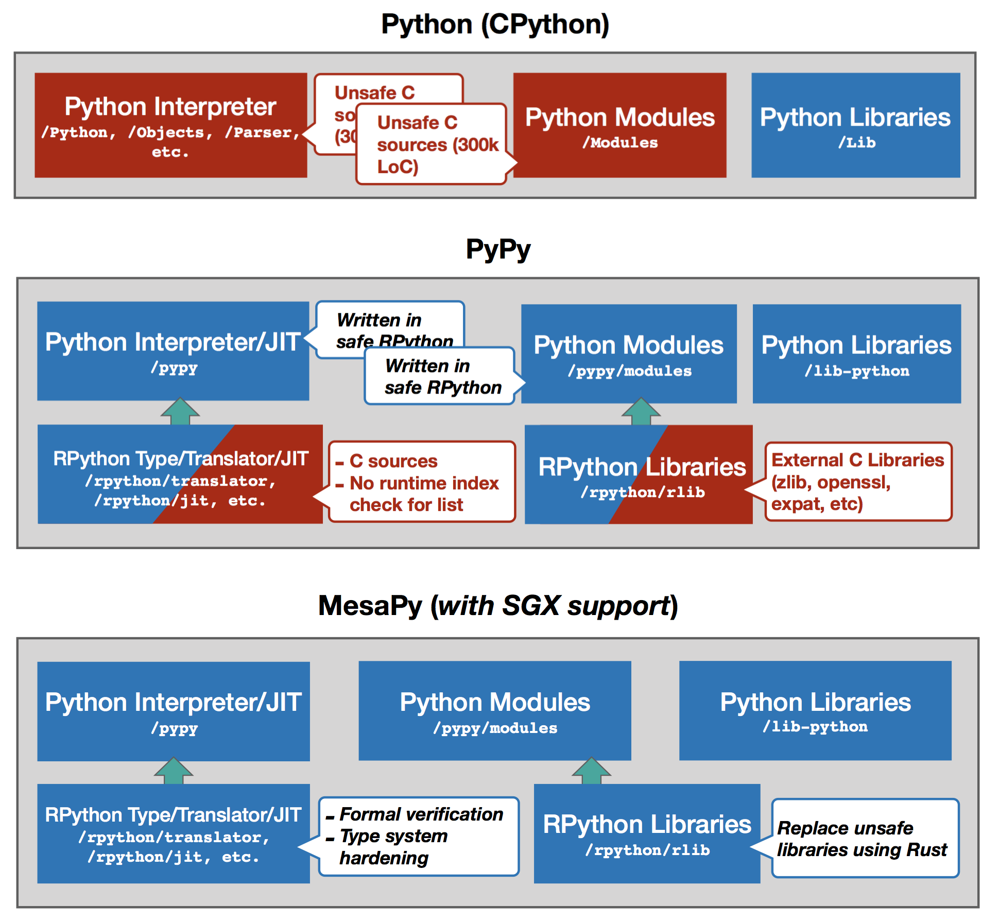
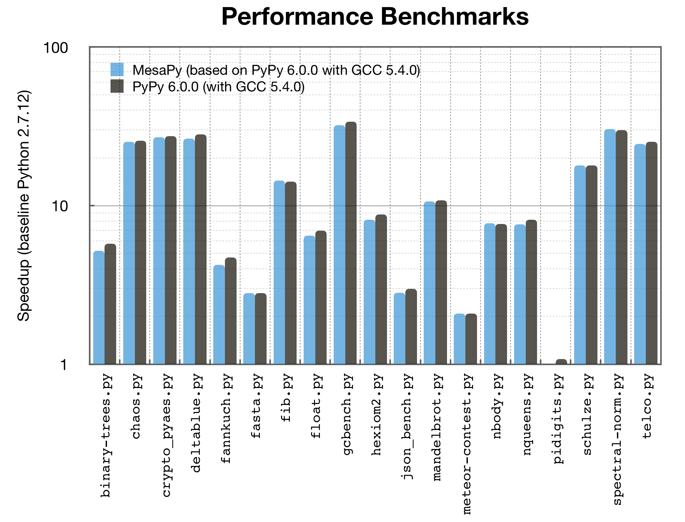

<p align="center"></p>

# MesaPy: A Memory-Safe Python Implementation based on PyPy

[](https://ci.mesalock-linux.org/mesalock-linux/mesapy)

English | [中文](README.cn.md)

MesaPy is a *memory-safe* Python implementation based on PyPy. In addition to
PyPy's distinct features -- speed (thanks to the JIT compiler), memory usage,
compatibility and stackless (massive concurrency), MesaPy mainly focuses on
improving its *security* and *memory safety*. On top of the enhancements, we
also bring MesaPy into **Intel SGX** to write memory-safe applications running
in the trusted execution environment.

We achieve the memory-safety promise through various methods: hardening
RPython's type system (RPython is the language for writing PyPy), modifying
PyPy/RPython's libraries, and verifying the RPython's libraries as well as its
translator/JIT backend. Overall, there are four most notable security
features of MesaPy:

- **Memory safety**: To provide a memory-safe runtime, MesaPy replaces external
  libraries written in C, which could introduce memory issues, with Rust, a
  memory-safe programming language. This guarantees the memory safety across
  all libraries including those written in Python, but also external libraries.

- **Security hardening**: PyPy is implemented with RPython, a statically-typed
  language with translation and support framework. We also enhanced
  memory-safety of RPython through hardening RPython's type system, i.e., the
  RPython typer. For example, we improve RPython's list with runtime index check
  to avoid arbitrarily list read/write during PyPy's implementation.

- **Formal verification**: Some code in RPython's libraries and its
  translator/JIT backend are still written in C, which may contain potential
  memory bugs. To prove the memory safety of RPython, we aim to formally
  verify its libraries and backend written in C using state-of-the-art
  verification tools.

- **SGX support**: With the memory safety of MesaPy, we also port it to
  Intel SGX, which is a trusted execution environment to provide integrity and
  confidentiality guarantees to security-sensitive computation. Developers now
  can easily use MesaPy to implement SGX applications without worrying about
  memory issues.

More details about each features, roadmap, and building process can be found here:
[https://docs.mesapy.org/](https://docs.mesapy.org/)

## Design

MesaPy enhances PyPy in security. Compared to CPython (also known as Python),
MesaPy provides a comprehensive security protection. Following figure illustrates
MesaPy's design and implementation. Blocks highlighted in red means unsafe
components, while blue blocks represent safe components. MesaPy aims to
protect Python runtime by our security hardening.

<p align="center">

</p>

By using formal verification, type system enhancement, and memory safe
programming language, MesaPy mitigates potential memory safety issues of both
CPython and PyPy. MesaPy's goal is to provide a fast and memory safe Python
runtime.

## Getting Started

Basically, you can use MesaPy as any other Python implementations (e.g., CPython
and PyPy). There are many ways to experience MesaPy:

  - the [pre-built binary](https://github.com/mesalock-linux/mesapy/releases) of MesaPy
  - use MesaLock Linux docker to try MesaPy: `docker run --rm -it mesalocklinux/mesalock-linux:latest mesapy`
  - build MesaPy by yourself from source

### Building MesaPy from source

Building MesaPy from source is very simple, you can simply use the docker provided
by MesaLock Linux and run `make pypy-c`. The detailed steps are explained in the
[documentation](https://docs.mesapy.org/building-from-source.html).

```
$ git clone --recursive git@github.com:mesalock-linux/mesapy.git # recursively clone mesapy and its submodules
$ cd mesapy
$ docker run --rm -it -v$(pwd):/mesapy -w /mesapy mesalocklinux/build-mesalock-linux make pypy-c
```

### Using MesaPy for SGX

One unique feature of MesaPy is to support Intel trusted execution environment
-- SGX. Developers now can use Python to implement security-sensitive
applications. The ultimate goal of MesaPy is to have SGX as a platform (just
like x86 and arm in MesaPy). Right now, the MesaPy for SGX is under the `sgx`
[branch](https://github.com/mesalock-linux/mesapy/tree/sgx/sgx), so please
checkout the branch first. You can follow the instruction in its
[README](https://github.com/mesalock-linux/mesapy/blob/sgx/sgx/README.md) to
start using MesaPy for SGX. Note that this is a work-in-progress feature,
current version has limited functions and packages. Contributions are very
welcome.

To run Python app in SGX is very simple:

  - checkout and build MesaPy for SGX
  - write Python embeddings
  - use MesaPy for SGX to build an SGX enclave with the Python embeddings

We also provide some examples (under the `/sgx/examples` directory ) to quickly start
using MesaPy for SGX. You can also read details in our
[documentations](https://github.com/mesalock-linux/mesapy/blob/sgx/sgx/README.md).

### Formal verification

There are still few lines of C code left in RPython translator/JIT and its
libraries which are difficult to eliminate. For these code, we still want to
guarantee its memory safety, by utilizing formal verification methods. We
use three state-of-the-art verification tools, Seahorn, Smack, and TIS
(TrustInSoft) to prove conclusively that the memory safety issues can never
occur, which includes:

  - Buffer overflow
  - Buffer over-read
  - Null pointer dereference
  - Memory leak
  
We have verified code in RPython translator, and the verification results are
illustrated in the verification directory. We are also working on a technical
report to present our findings.

The detailed instructions and additional mocks are also included in each tool's
separate directory. You can easily reproduce the verification process. You are
welcome to contribute mocks and help us to verify files in the TODO list.

## Benchmark

We used 19 Python scripts to run our performance evaluation. Each script is
executed in ten times for MesaPy, PyPy 6.0.0, and Python 2.7.12 respectively.
The benchmarks are shown in the following figure.

<p align="center">

</p>

Thanks to JIT and efficient GC mechanism, MesaPy can achieve 10x plus speedup
compared to Python 2.7.12.

## Contributing

We still have some working-in-progress sub-projects. We are very happy if you
are interested to help out. Here are several topics you can get involved:

  - porting Rust libraries into MesaPy and replacing previous external C
    libraries
  - helping to verifying "unsafe" components using current state-of-the-art
    verification tools
  - improving MesaPy in SGX (bringing in useful libraries in normal world into
    SGX)

For each topic, we provided detailed instructions to get started. Feel free to
pick an interesting one and improve MesaPy and send us pull requests on the
GitHub. If you find it a little difficult, you can also talk to our maintainers
for help.

## Acknowledgment

The MesaPy project would not have been possible without the following
high-quality open source projects.

  - PyPy: [PyPy](http://pypy.org/) is a fast, compliant alternative
    implementation of the Python language, which provides distinct features --
    speed, memory usage, compatibility, and stackless. Thanks to these amazing
    [maintainers](https://pypy.org/people.html).

## Maintainer

Thanks to our maintainers to contribute this projects. Feel free to submit issues
on GitHub or send us email. We are very glad to help out.

The projects are maintained by:

  - **Memory-safety, security hardening, SGX, and all about MesaPy**: Mingshen Sun (`@mssun`)
  - **Formal verification**: Qian Feng (`@qian-feng`)

Also, thanks to our contributors: Huibo Wang (`@MelodyHuibo`)and Yu Ding (`@dingelish`)

## Steering Committee

  - Tao Wei
  - Yulong Zhang

## License

MesaPy is provided under the 3-Clause BSD license. MesaPy is built upon PyPy and
other open source projects, see the [LICENSE](LICENSE) file for detailed licenses.
