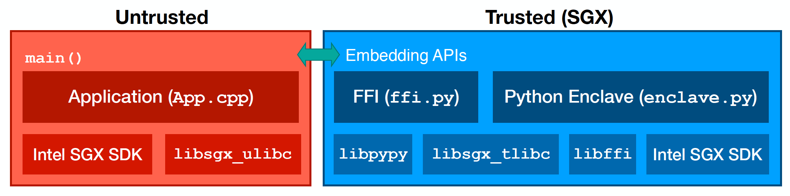

# MesaPy for SGX

MesaPy for SGX aims at helping developers to write memory-safe Intel SGX apps in
Python with minimal TCB.

## Design

The design of MesaPy for SGX can be illustrated in the following figure.

<p align="center">

</p>

Untrusted part:
- application: contains application's untrusted logic (`App.cpp`)
- `libsgx_ulibc`: defines ocall functions for SGX enclave
- Intel SGX SDK

Trusted part:
- FFI (`ffi.py`): an FFI middleware to call real python function
- Python enclave (`enclave.py`): defines some Python functions executed in SGX
- `libpypy`: the MesaPy library to support the Python interpreter and also
  contains some useful modules
- `libsgx_tlibc_ext`: defines helper functions and ocall shim functions
- `libffi`: provides foreign function interface (FFI) support
- Intel SGX SDK

## Getting Started

### Prerequisites

MesaPy for SGX needs following hardware requirements to run SGX:

- CPU with Intel SGX support (6th Generation Intel Core Processor or newer, you
  can check in the [list of SGX supported hardware](https://github.com/ayeks/SGX-hardware))
- Intel SGX option enabled in BIOS

Also, ensure that you have one of the follwing operating systems required by SGX:

- Ubuntu 16.04.3 LTS 64-bit Desktop version
- Ubuntu 16.04.3 LTS 64-bit Server version
- Red Hat Enterprise Linux Server release 7.4 64bits
- CentOS 7.4.1708 64bits
- SUSE Linux Enterprise Server 12 64bits

Please refer to the [Intel SGX for Linux](https://github.com/intel/linux-sgx)
project for the cutting edge version. Now, we use Ubuntu 16.04.3 as an example
to show steps to get started with MesaPy for SGX.

### Installing Intel SGX

Let's install dependencies for Instal SGX PSW and SGX SDK first. Following instructions are
for Ubuntu 16.04, you can find detailed guilde from
the [Intel SGX Installation Guide](https://download.01.org/intel-sgx/linux-2.2/docs/Intel_SGX_Installation_Guide_Linux_2.2_Open_Source.pdf).

```sh
# Install dependencies of Intel SGX PSW:
$ sudo apt-get install libssl-dev libcurl4-openssl-dev libprotobuf-dev

# Install dependencies of Intel SGX SDK
$ sudo apt-get install build-essential python

# Install trusted platform service
# Download Capability Licensing Client (iCLS) for Linux 64-bit clinet from https://software.intel.com/en-us/sgx-sdk/download
$ sudo apt-get install alien
$ sudo alien --scripts iclsClient-1.45.449.12-1.x86_64.rpm
$ sudo dpkg -i iclsclient_1.45.449.12-2_amd64.deb

# Download dynamic-application-loader-host-interface from https://github.com/intel/dynamic-application-loader-host-interface
# Install dependencies
$ sudo apt-get install uuid-dev libxml2-dev cmake pkg-config
$ cmake .; make; sudo make install;sudo systemctl enable jhi
```

Then, let's install driver, PSW packages and SDK. First, download them from
[https://download.01.org/intel-sgx/linux-2.2/](https://download.01.org/intel-sgx/linux-2.2/).
Then, follow these instructions to install.

```sh
$ sudo ./sgx_linux_x64_driver.bin
$ sudo ./sgx_linux_<os>_x64_psw_<version>.bin
$ sudo ./sgx_linux_<os>_x64_sdk_<version>.bin
```

### Building MesaPy for SGX

Install dependencies of building MesaPy for SGX.

```sh
$ sudo apt-get install gcc make libffi-dev pkg-config libgdbm-dev libgc-dev python-cffi pypy pypy-dev
```

Clone the MesaPy repository from GitHub recursively with its submodules. Note
that MesaPy for SGX is in the `sgx` branch.

```sh
$ git clone -b sgx --recursive git@github.com:mesalock-linux/mesapy.git
```

Build MesaPy for SGX:

```sh
$ cd mesapy
$ make sgx
```

The building process takes around 15 minutes depending on your machine.
Then, you will get a `libpypy-c.a` file in the `pypy/goal` directory.

The detailed instructions of building MesaPy are described in the
[documentation](https://docs.mesapy.org/building-from-source.html).

Note that, we also provide a `Dockerfile` with all essential dependencies.
You can build an image by execute `./mesapy-sgx-docker.sh build` and run the image
by execute `./mesapy-sgx-docker.sh run`.

### Starting with the `hello_world` example

First, you need to setup Intel SGX SDK environment properly.

```sh
$ source $(SGX_SDK)/environment    # setup environment variables of Intel SGX SDK
```

Build the `hello_world` example:

```sh
$ cd sgx/examples/hello_world
$ make
```

Run the `hello_world` example, you will see hello world and welcome messages:

```sh
$ ./app
Hello, World!
Welcome to MesaPy for SGX.
Do what I mean: 42

Info: hello_world successfully returned.
Enter a character before exit ...
```

Also, you can build and run the example with a single command: `make run`.

### Writing your own Python enclave

Writing a Python enclave is pretty simple. Fistly, we need to write Python code
and export it as external CFFI functions. Here is a simple code from the
`hello_world` example (`python_enclave.py`) with detailed comments.

```python
import sgx_cffi
import _cffi_backend as backend

ffi = sgx_cffi.FFI(backend)

# declare the `say` function
ffi.embedding_api("void say();")

# put your Python code here, you can also read the code from another file
ffi.embedding_init_code(
"""
from python_enclave import ffi
import __pypy__

# define the `say` function as CFFI extern function
@ffi.def_extern()
def say():
    print "Hello, World!"
"""
)

# generate CFFI code
ffi.set_source("python_enclave", "")
ffi.emit_c_code("python_enclave.c")
```

The second step is to declare functions in EDL as trusted function. In this example,
we should declare the `say` function in `Enclave.edl` like this:

```
enclave {

    trusted {
        public void say();
    };

    // import untrusted functions from sgx_ulibc
    from "sgx_u_unistd.edl" import *;

};
```

At last, you can write your own application (e.g., the `App/App.cpp` file in the
example) to call the trusted python function.

## Current Status

Because of security concerns, MesaPy for SGX is not designed as a general
purpose Python interpreter for SGX. That is, some full-fledged libraries and
modules can not be used in MesaPy for SGX without any modifications.

Currently, MesaPy for SGX supports Python 2 syntax and most built-in
functions. For the standard library, it supports these modules (because
dynamic module importing is an ongoing feature, more modules will be supported
when it's done):

- essential modules: `exceptions`, `_file`, `sys`, `__builtin__`, `_warnings`,
  `itertools`,
- default modules: `__pypy__`, `marshal`, `operator`, `_ast`, `_weakref`,
  `_cffi_backend`
- additional working modules: `_codecs`, `gc`, `_weakref`, `marshal`, `errno`,
  `imp`, `math`, `cmath`, `_sre`, `_pickle_support`, `operator`, `parser`,
  `symbol`, `token`, `_ast`, `_io`, `_random`, `__pypy__`, `_testing`,
  `cStringIO`, `struct`, `array`, `binascii`, `itertools`, `_md5`, `_sha`,
  `_collections`, `micronumpy`, `_cffi_backend`, `_pypyjson`.

The modules may be updated in the future, and the full list can be found
at the
[`pypy/config/pypyoption.py`](https://github.com/mesalock-linux/mesapy/blob/sgx/pypy/config/pypyoption.py#L17-L38)
file.
We also test these modules in SGX in the
[`sgx/tests`](https://github.com/mesalock-linux/mesapy/tree/sgx/sgx/tests)
directory.

## Roadmap

MesaPy for SGX is still a work-in-progress project. Right now, it supports simple
tasks like secure computation. Here is a TODO list.

  - bring more Python modules into SGX (e.g., the standard library and NumPy)
  - multi-threading support
  - remote attestation

If you are interested in contributing to MesaPy for SGX, feel free to open an issue
stating your plan and start working on it.

## License

MesaPy for SGX is provided under the 3-Clause BSD license. MesaPy for SGX is
built upon PyPy and other open source projects, see the
[LICENSE](https://github.com/mesalock-linux/mesapy/blob/mesapy2.7/LICENSE) file
for detailed licenses.
